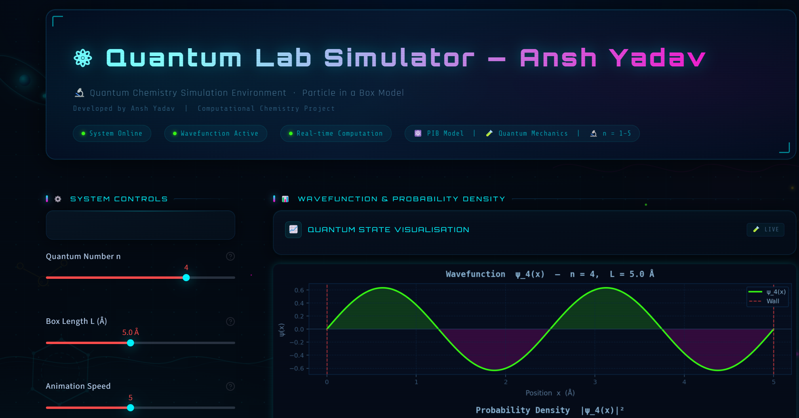

# ⚛ Quantum Lab Simulator — Ansh Yadav

A futuristic **Quantum Mechanics Simulation Dashboard** that visualizes the behavior of a particle confined in a one-dimensional box using principles of quantum mechanics.

---

## 🚀 Features

✨ Interactive quantum simulation
📊 Wavefunction ψ(x) visualization
📈 Probability density |ψ(x)|²
⚡ Energy level diagram (multiple levels)
🌊 Time-dependent phase animation
🎨 Futuristic neon UI with animated background
🧪 Quantum chemistry inspired design

---

## 🧠 Concept

This project is based on the **Particle in a Box** model from quantum mechanics.

* The particle is confined between two infinite potential walls
* The wavefunction is sinusoidal in nature
* Energy levels are quantized

Mathematically:

ψₙ(x) = √(2/L) · sin(nπx / L)

* ψ(x): Wavefunction
* ψ²(x): Probability density
* Energy ∝ n²

---

## 🖥️ Tech Stack

* Python 🐍
* Streamlit ⚡
* NumPy 🔢
* Matplotlib 📊

---

## ▶️ How to Run This Project (Important)

⚠️ This project uses Streamlit, so it will NOT run using `python app.py`.

Follow these steps:

### 1. Install required libraries

Open terminal in the project folder and run:

pip install streamlit numpy matplotlib

---

### 2. Run the project (Correct way)

streamlit run app.py

---

### 3. Open in browser

After running the above command, you will see:

Local URL: http://localhost:8501

👉 Open this link in your browser.

---

### ❌ Common Mistake (Do NOT do this)

python app.py

This will NOT work.

---

### ✅ Final Output

You will see:

* Interactive quantum simulation
* Wavefunction and probability graphs
* Energy level diagram
* Animated quantum behavior

---

## 📸 Preview

---

## 📁 Project Structure

quantum-lab-simulator/
│
├── app.py
├── README.md
├── requirements.txt

---

## 👨‍💻 Author

**Ansh Yadav**

---

## ⭐ Acknowledgment

Built with the help of modern AI tools and enhanced with custom UI/UX design to create a visually rich simulation experience.

---

## 🔥 Final Note

This is not just a project — it's a **Quantum Simulation Experience** ⚛️

